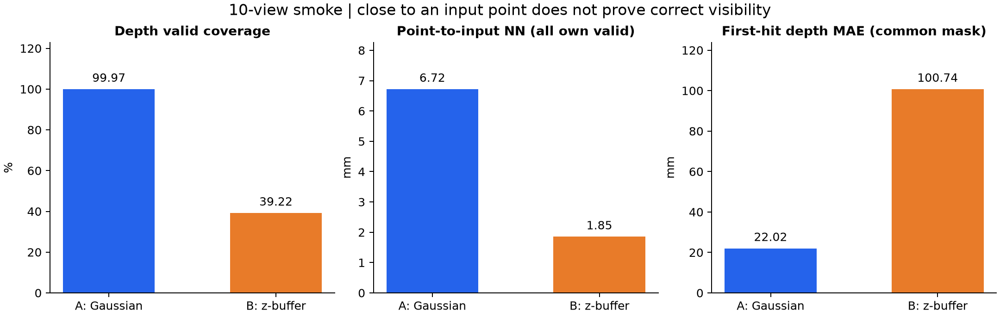

This repository copy contains the actual executed Colab notebook, source
scripts, camera TXT, verification, numerical metrics, and ten comparison figures.
Raw PNG sets and the large Gaussian/backprojected PLYs remain in the local
`D:/codex/blenderProject/3dgsResult/zs601-depth-methods-v007/` package.
The scripts intentionally retain the experiment's explicit workspace paths and
hashes. No training was performed; the point z-buffer's visibility failure is a
measured result, not a passing quality claim.

# Noglass 1 cm：两种深度生成与 PNG 反投影冒烟测试

已完成两种方法各 10 张测试，使用同一份 7,004,696 点的仿真 noglass 1 cm 点云、相同相机与分辨率。实际执行无训练、无参数优化。本次仅为冒烟测试，没有扩展到 200 张深度对比。

高斯法覆盖完整、相对可见表面的深度误差较小，但在物体边界出现向前扩张。纯点 z-buffer 的反投影更靠近原始点，存在大量被遮挡表面泄漏；最近邻误差不能证明其遮挡正确。两者均不能无条件当作精确深度真值。

## 已完成的前序任务

玻璃材质具有 `semantic_class=clear_glass` 标签，已验证 Transmission=1。33 个玻璃部件、3,468 个三角形被排除，去掉 176,124 个原 1 cm 样本；透明塑料及名称含 Glass 的不透明部件仍保留。

- 新的 noglass 1 cm 点云（本地文件 `../zs601-mesh-noglass-v006/cloud_1cm/points_mesh_1cm_noglass.ply`）：7,004,696 点，用于虚拟图像。
- 新的 noglass 3 cm 点云（本地文件 `../zs601-mesh-noglass-v006/cloud_3cm/points_mesh_3cm_noglass.ply`）：797,520 点，用于后续正式训练初始化。
- [200 张虚拟图像及完整报告](../synthetic-mesh-noglass-v006/README.md)：Black PSNR 22.0253 dB，SSIM 0.769143，原 RGB mask 空缺 0.250455%。相对上一版 19.4026 dB 的白色玻璃遮挡问题已改善；残留着色误差，未通过逼真度验收。该轮 opacity=0.999999，本次深度测试单独设 float32 opacity=1。

上述版本已冻结并保留原文件。1 cm/3 cm 表示按部件的体素采样尺度，不能解释为严格的两点最小距离。

## 固定条件与实现

输入 SHA256：`68f26fca61b4c1424c1f45f2f4983c4c42cf389abc23d6e0afadd9d48819de5b`。用户已明确确认两法都用该仿真输入，没有使用真实 LAS。随机种子 `20260922`，从既定 200 个 virtual_near 相机无放回抽样 10 个；并非按图像质量挑选。分辨率 **640 × 1108**，COLMAP PINHOLE、米制世界坐标。

**A：初始化高斯。** 原点的位置、SH0 颜色、旋转和 k=3 的尺度保持逐字段完全一致；`sigma = 0.5 * sqrt(mean(d_nearest3**2))`，sigma 中位数 4.407881 mm。仅不透明度改为有限 logit=20，float32 sigmoid 实测全部等于 1（数学值约 0.99999999794）。原 CUDA 光栅器单片元 alpha 上限仍为 0.99。输出深度采用原代码的 `Z = alpha / sum(T_i * alpha_i / Z_i)`，是 alpha 归一化的加权调和 camera-Z，**不保证等于首个表面的深度**。

**B：纯点投影。** 直接将原点变换到相机坐标，按 `floor(u), floor(v)` 归入像素，保留该像素最小的 float64 camera-Z；同深选最小来源索引。无高斯、无点半径、无插值、无补洞、无 mesh 辅助筛选。共剔除 5,422,987 个同像素后方候选，其中 4,470,058 个比获胜点深超过 3 cm。这只解决同像素候选的遮挡，不能自动遮住前景采样空隙。

## 定量结果

| 指标 | A：高斯 scale 0.5 | B：纯点 z-buffer |
|---|---:|---:|
| 深度有效覆盖率 | 99.9723 | 39.2209 |
| 深度 mask 空缺比例（%） | 0.0277 | 60.7791 |
| RGB 原 mask 空缺比例（%） | 0.3322 | 60.7791 |
| 反投影点到输入点云 NN 均值（mm） | 6.719 | 1.852 |
| NN 中位数（mm） | 5.594 | 1.575 |
| NN P95（mm） | 12.364 | 4.154 |
| NN RMSE（mm） | 12.310 | 2.190 |
| 共同有效像素：深度 MAE（mm） | 22.019 | 100.740 |
| 共同有效像素：深度 RMSE（mm） | 104.894 | 244.594 |
| 共同有效像素：深于首交表面 >3 cm（%） | 0.1171 | 42.9031 |
| 共同有效像素：浅于首交表面 >3 cm（%） | 10.6329 | 1.1187 |
| 各自有效像素：深度 MAE（mm） | 13.387 | 100.740 |

共同区域共 **2,781,085** 个像素：A 深度有效 ∩ B 深度有效 ∩ mesh 参考有效。汇总按全部有效像素/点加权，不是各图均值简单平均。各自有效区域误差的支持范围不同，不能替代共同区域比较。原点云 NN 是单向距离，B 保留输入点，天然在此指标上占优；没有声称整个场景的完整性。

独立的 noglass mesh 首交深度只用于评价，不参与任何一法生成，也不裁掉导出的反投影点。所有玻璃三角形使用与采样完全相同的语义布尔掩码排除。射线从 camera-Z=0.2 m 处起始，保留到 65.535 m；三维方向不归一化，使 Embree `tfar + 0.2` 等于 camera-Z。该参考是当前仿真几何的可见表面，不是真实房间的独立几何真值，也不模拟玻璃折射。

**遮挡复核。** 另对每张 B 图随机抽样 10,000 个获胜原点，直接沿相机中心到原始 3D 点的精确射线求交，避开像素中心取整和 PNG 量化；100,000 点中 46.375% 位于首交面后超过 3 cm，按各图有效像素数加权估计 43.0989%，接近完整评价 42.9031%。30 例另用 float64 三角形求交复核。相机 3202 的门踢板点被椅背遮挡，前后相差 3.529 m；也发现桌下地面、墙板背面和同一实体厚度背面的泄漏。详见 [独立审查](reproducibility/audit_evaluator.json)。

A 的共同区域还有 **10.6329%** 像素浅于首交面超过 3 cm，主要可见于边缘扩张，不能仅凭其后方泄漏比例低就宣称遮挡完全正确。B 当前实现未通过遮挡质量检查。现有有效 mask 只表示覆盖，不代表深度正确；本次保留原始输出，没有用 mesh 参考修饰结果。

## 文件与格式

| 文件 | 编码和含义 |
|---|---|
| `method_*/depth/*.png` | PNG **16 bit、单通道 uint16**；数值=四舍五入的 camera-Z 毫米。0=无效；`Z_m = value / 1000`；不含 gamma 或伪彩色。非欧氏射线长度，范围 0.001–65.535 m。 |
| `method_a_gaussian/depth_mask/*.png` | PNG 8 bit、单通道；255=alpha≥0.5 且深度有效，0=无效。 |
| `method_a_gaussian/masks/*.png` | PNG 8 bit、单通道；255=alpha≥0.95，保留原 RGB 训练覆盖 mask 规则。它与深度 mask 不同。 |
| `method_a_gaussian/alpha/*.png` | PNG 16 bit、单通道；alpha=`value/65535`，0 才表示存储精度下完全无覆盖。 |
| `method_b_zbuffer/masks/*.png` | PNG 8 bit、单通道；255=像素有投影点，0=空缺；RGB 和深度共用。 |
| `method_*/images/*.png` | PNG 8 bit、RGB 3 通道。A 是 black 合成；B 为获胜原点颜色，空缺黑色。 |
| `method_*/depth_float/*.npy` | float32 camera-Z 米，0 无效，仅供量化诊断；交付 PLY 全部从实际 PNG 解码后生成。 |
| `method_b_zbuffer/winner_source_id/*.npy` | int32，输入 1 cm PLY 的零起始行索引；-1 无效。 |
| `method_*/backprojected/*.ply` | binary little-endian，XYZ float32 米、RGB uint8；每图一份。含对应 PNG 的全部有效像素，无 ICP、无 mesh 筛除。 |
| `method_*/backprojected/merged_10views.ply` | 按相机顺序合并；A 7,089,236 点，B 2,781,236 点；保留多视角重复表面，没有再次体素化。 |
| `method_a_gaussian/point_cloud/iteration_0/point_cloud.ply` | 本次 opacity=1 的初始化 Gaussian 参数 PLY，包含 SH0、log-scale、quaternion、opacity logit；不是普通 XYZRGB 点云。 |
| `sparse/0/cameras.txt`、`images.txt` | 本次 10 相机的标准 COLMAP TXT；两法完全共用，POINTS2D 行为空。本轮 camera-only `points3D.txt` 无伪造 SfM 轨迹；原点云由上面的已哈希输入引用。 |
| `reference_noglass_mesh/` | 仅评价参考：mesh 首交 PNG/float 深度、有效 mask 和边界 mask；不得作为 B 的生成输入或隐式训练筛选。 |
| `comparison_figures/` | 最终伪彩色深度/误差对照；不是训练深度文件。所有图深度固定 0–10 m；误差固定 ±100 mm，超过范围饱和显示。 |
| `comparisons/` | 保留的初次绘图布局，标题有裁切；最终查看 `comparison_figures/`。数值输入相同。 |

读取例子（仅有效像素用于损失）：

```python
raw = np.asarray(Image.open(depth_path))   # 保持 uint16，不能 convert("L")
valid = np.asarray(Image.open(mask_path)) > 0
z_m = raw.astype(np.float32) / 1000.0
inverse_z = np.zeros_like(z_m)
inverse_z[valid] = 1.0 / z_m[valid]        # 仅当训练损失需要逆深度时转换
```

反投影像素中心为 `(u+0.5, v+0.5)`：`p_camera=[(u+.5-cx)/fx*Z, (v+.5-cy)/fy*Z, Z]`，COLMAP 为 world→camera `p_camera=R*p_world+t`，所以 `p_world=R.T*(p_camera-t)`。使用这一方式回读 PNG 后生成两组 PLY；所有 PLY 二进制回读完全一致。B 的点会有半像素取整造成的横向偏移，不能要求与来源点严格零距离；已逐点检查位于像素取整与深度量化的理论误差界内。

PNG 相机 Z 的最大量化误差约 **0.50025 mm**，反投影中最大位置量化位移约 **0.7613 mm**，远小于当前遮挡误差。未执行 3DGS 正式训练，未宣称训练代码已直接兼容上述深度格式；训练端需明确使用米制 Z 或转换后的逆深度。

## 每图结果与可视检查

| 相机 | A 深度覆盖率 | B 深度覆盖率 | A / B 共同区域 MAE（mm） | 对照图 |
|---|---:|---:|---:|---|
| 003202 | 100.00% | 63.11% | 44.17 / 137.32 | [查看](comparison_figures/003202_depth_comparison.png) |
| 003340 | 100.00% | 48.84% | 13.52 / 121.32 | [查看](comparison_figures/003340_depth_comparison.png) |
| 003376 | 100.00% | 48.83% | 16.32 / 93.07 | [查看](comparison_figures/003376_depth_comparison.png) |
| 003388 | 100.00% | 41.72% | 14.93 / 87.01 | [查看](comparison_figures/003388_depth_comparison.png) |
| 003409 | 100.00% | 21.67% | 5.22 / 67.96 | [查看](comparison_figures/003409_depth_comparison.png) |
| 003481 | 100.00% | 9.62% | 4.68 / 49.04 | [查看](comparison_figures/003481_depth_comparison.png) |
| 003505 | 100.00% | 55.43% | 22.85 / 87.51 | [查看](comparison_figures/003505_depth_comparison.png) |
| 003520 | 99.72% | 35.79% | 10.97 / 52.64 | [查看](comparison_figures/003520_depth_comparison.png) |
| 003571 | 100.00% | 11.48% | 3.88 / 50.27 | [查看](comparison_figures/003571_depth_comparison.png) |
| 003583 | 100.00% | 55.72% | 34.20 / 134.39 | [查看](comparison_figures/003583_depth_comparison.png) |



详细数值：[geometry_metrics.json](metrics/geometry_metrics.json)、[逐图 CSV](metrics/per_view.csv)。

## 复现与交付检查

可复现代码和实际执行笔记本位于 [reproducibility](reproducibility/)。`run_gaussian_depth.py` 在 Colab L4 复用已核验的源输入和固定 CUDA renderer；`project_zbuffer.py` 在本地执行纯点投影；`evaluate_depth.py` 共用一套 PNG 反投影/PLY 保存/评价代码；`audit_evaluator_probe.py` 独立复核。相机随机抽样、输入 SHA、非 opacity 高斯字段、PNG dtype/位深/通道、坐标回投、PLY 回读、解析射线单元检查均通过。实际笔记本无 error 输出，0 训练步。源输入与旧版本未修改。

这组脚本记录 Blender 工作区路径，notebook 依赖该轮通过 CLI 部署的已哈希文件和固定 renderer 版本；它不是不需要输入文件的即开即用在线演示。Gaussian renderer 源版本为 `4c7186e363f14050c4977bb192f12ed237112764`。实际执行 Notebook 随代码同步到 `VISjudy/ZS601_3DGS` 的 `synthetic-lidar-init-v4` 分支；大体积 PLY/PNG 保留本地。

Colab 专用会话已停止，CLI 复核无活动会话。格式与流程验证通过；几何质量的限制保留在报告中，没有把失败的遮挡检查写成通过。
